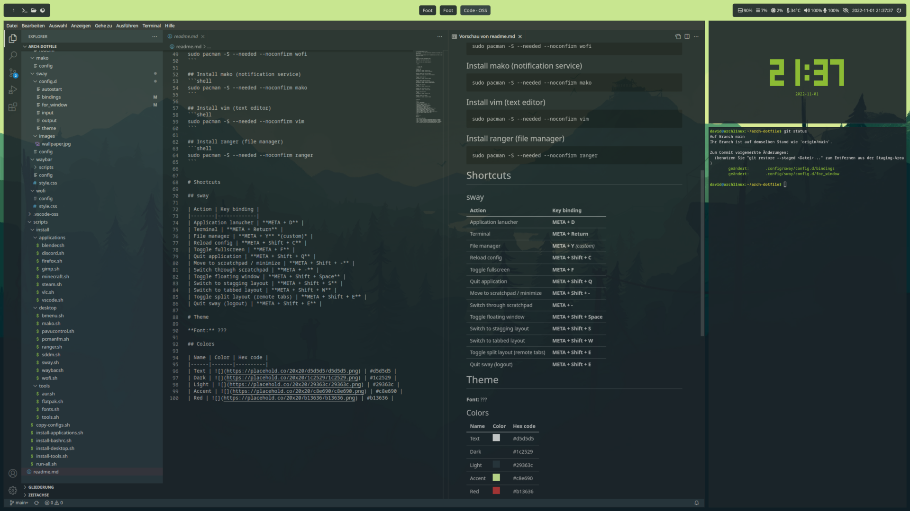

# Arch Desktop template by Arcus



This repository is still under construction and serves as my personal Arch desktop setup. 

This is far from finished and I don't recommend to use any of this on your productive system. This is just a learning experience on how to create a custom Arch desktop from scratch.

If you find any issues or have any suggestions to improve this setup, please let me know.

# Notes

## Quickfix to change the keyboard layout
```shell
swaymsg input type:keyboard xkb_layout de
```

*How to write this with a German keyboard:*

```z = y```

```/ = -```

```_ = Shift + ß```

```: = Shift + Ö```


# Installation

- Install Arch Linux using the minimal desktop environment and Grub
- Reboot and login
- Install git using `sudo pacman -S --needed --noconfirm git` 
- Clone the repository using `git clone https://github.com/Arucs92/arch-dotfiles.git`
- Enter the directory with `cd ./arch-dotfiles`
- Install everything with `./scripts/run-all.sh`

The AUR of some application can break randomly. If an optional scripts fails you can remove it or execute the other scripts manually.

# Themes

This setup using a dynamic theming engine. Thats a fancy way to say that there is a bodge script that replaces color and theme variables for all config files.

The colors are defined in `./scripts/themes/`. The script that copies copies the config files and applies the theme is `./scripts/copy-configs.sh'. You can run this anytime after the installation when you changed the theme. Just reload sway afterwards using **META + Shift + C**.

# Shortcuts

| Action | Key binding |
|--------|-------------|
| Terminal | **META + Return** |
| Application launcher | **META + D** |
| File manager | **META + Y** |
| Lock out | **META + L** |
| Quit application | **META + Q** |
| Switch to stagging layout | **META + S** |
| Switch to tabbed layout | **META + W** |
| Toggle split layout (remote tabs) | **META + E** |
| Toggle full screen | **META + F** |
| Move to scratchpad / minimize | **META + -** |
| Switch through scratchpad | **META + Shift + -** |
| Toggle floating window | **META + Shift + Space** |
| Screenshot | **META + Shift + S** |
| Reload config | **META + Shift + C** |
| Quit sway (logout) | **META + Shift + E** |

# Applications

## Desktop

- [sway](https://github.com/swaywm/sway)
- [swaybg](https://github.com/swaywm/swaybg)
- [swayidle](https://github.com/swaywm/swayidle)
- [swaylock](https://github.com/swaywm/swaylock)
- [swaync](https://github.com/ErikReider/SwayNotificationCenter)
- [sddm](https://github.com/sddm/sddm)
- [bmenu-wayland](https://github.com/Cloudef/bemenu)
- [nemo](https://github.com/linuxmint/nemo)
- [waybar](https://github.com/Alexays/Waybar)
- wofi *dead?*
- [pavucontrol](https://github.com/pulseaudio/pavucontrol)
- [gtk](https://github.com/GNOME/gtk)
- [qt](https://github.com/qt)

## Applications

- [Blender](https://www.blender.org/)
- [Discord](https://discord.com/) *AUR*
- [Dolphin Emu](https://github.com/dolphin-emu/dolphin)
- [Enpass](https://www.enpass.io/)
- [Firefox](https://www.mozilla.org/firefox/)
- [GIMP](https://www.gimp.org/)
- [Handbrake](https://handbrake.fr/)
- [LibreOffice](https://www.libreoffice.org/)
- [Lutris](https://lutris.net/)
- [MakeMKV](https://www.makemkv.com/)
- [Minecraft](https://www.minecraft.net/)
- [Steam](https://store.steampowered.com/)
- [Thunderbird](https://www.thunderbird.net/)
- [VLC](https://www.videolan.org/vlc/)
- [Visual Studio Code](https://code.visualstudio.com/)
- [Yuzu](https://yuzu-emu.org/) *early access*

## Tools

- [foot](https://codeberg.org/dnkl/foot)
- AMD Gpu driver
- [mesa](https://github.com/Mesa3D/mesa)
- [git](https://github.com/git/git)
- [Flatpak](https://flatpak.org/)
- [grub](https://www.gnu.org/software/grub/grub.html)
- [cups](https://github.com/OpenPrinting/cups)
- [nano](https://nano-editor.org/)
- [ffmpeg](https://ffmpeg.org/)
- [jdk-openjdk](https://openjdk.org/)
- [wine](https://www.winehq.org/)
- [htop](https://github.com/htop-dev/htop)
- [tty-clock](https://github.com/xorg62/tty-clock)
- [cbonsai](https://gitlab.com/jallbrit/cbonsai)